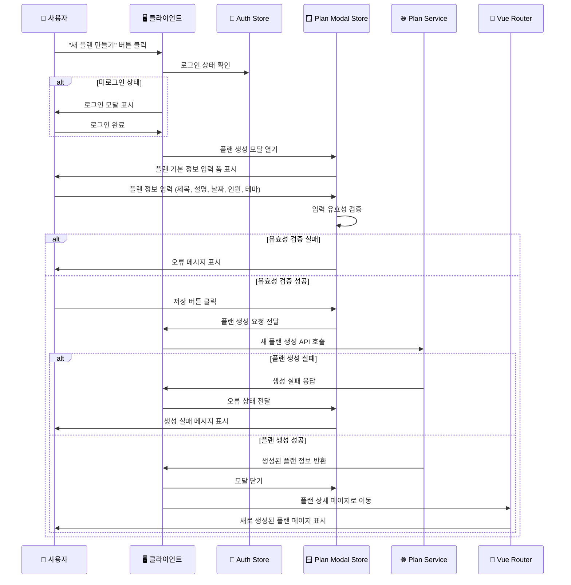
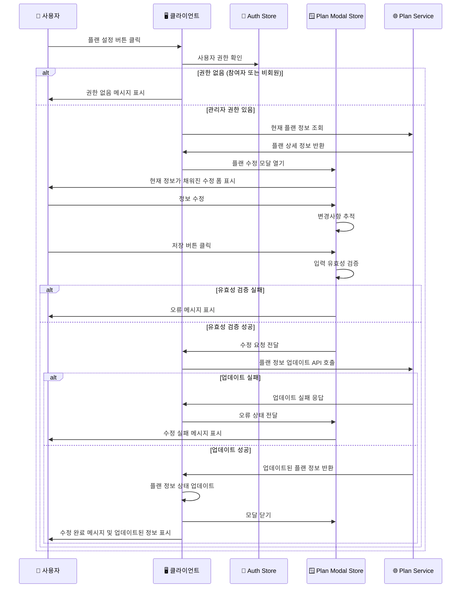
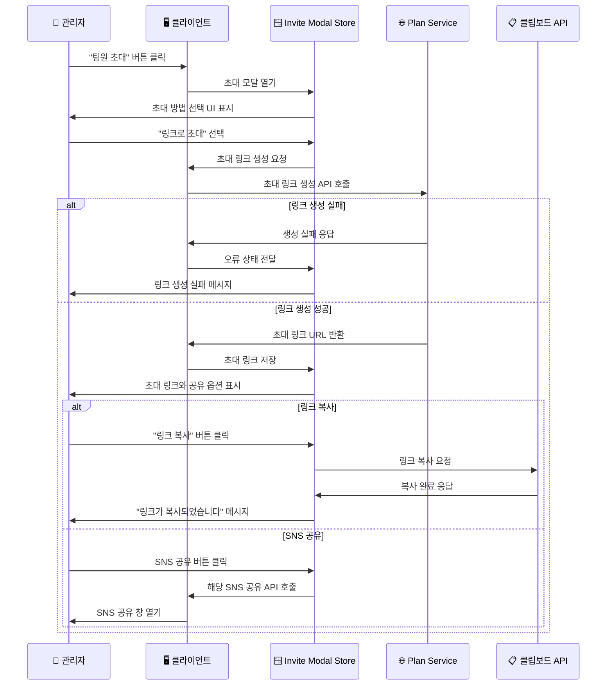
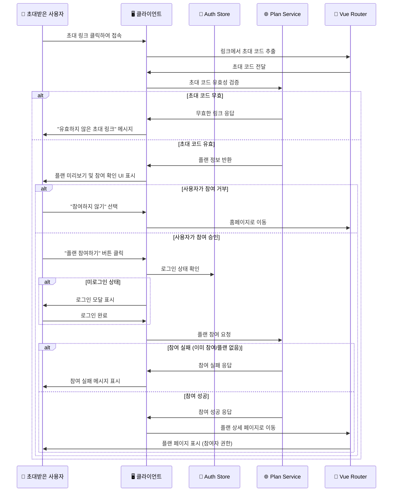
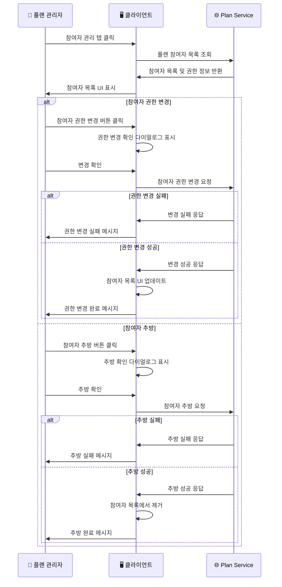
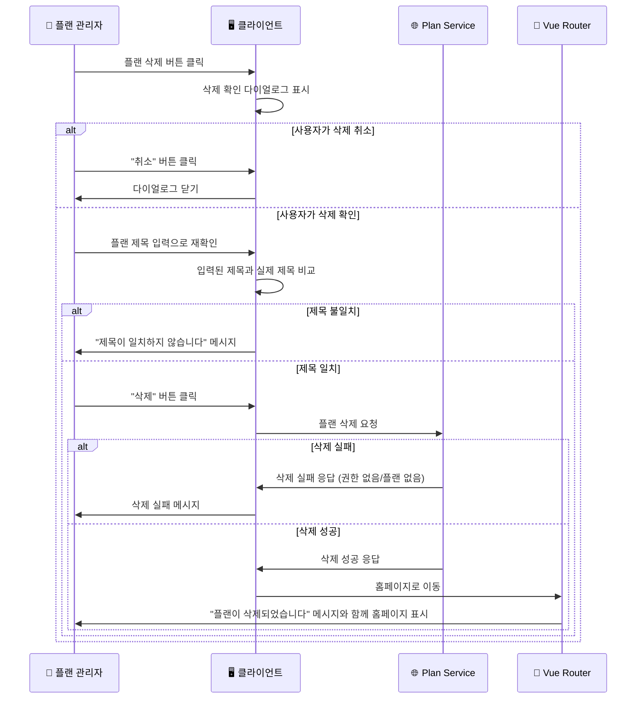

# 플랜 관리 시퀀스 다이어그램

## 1. 새 플랜 생성 시퀀스

## 2. 플랜 정보 수정 시퀀스

## 3. 초대 링크 생성 및 공유 시퀀스

## 4. 초대 링크를 통한 플랜 참여 시퀀스

## 5. 참여자 관리 시퀀스

## 6. 플랜 삭제 시퀀스

## 주요 특징

### 🔐 권한 기반 접근 제어

- **관리자 권한**: 플랜 수정, 삭제, 참여자 관리는 관리자만 가능
- **참여자 권한**: 플랜 조회, 여행지 추가 제안은 모든 참여자 가능
- **실시간 권한 확인**: 모든 액션 전 사용자 권한 검증

### 🔗 초대 시스템

- **링크 기반 초대**: 간단한 링크 공유로 플랜 참여 가능
- **다양한 공유 방법**: 링크 복사, SNS 공유 등 다중 공유 옵션
- **보안**: 초대 링크 유효성 검증 및 만료 처리

### 🎯 사용자 경험

- **확인 절차**: 중요한 작업(삭제, 추방)에 대한 이중 확인
- **실시간 업데이트**: 플랜 정보 변경 시 즉시 UI 반영
- **명확한 피드백**: 모든 액션에 대한 성공/실패 메시지

### 📱 상태 관리

- **모달 상태**: Pinia를 통한 모달 상태 중앙 관리
- **캐싱**: 플랜 정보 캐싱으로 불필요한 API 호출 방지
- **동기화**: 여러 사용자 간 플랜 정보 실시간 동기화

### 🛡️ 데이터 무결성

- **입력 검증**: 클라이언트와 서버 양쪽에서 데이터 검증
- **롤백 처리**: 실패 시 이전 상태로 복구
- **일관성 보장**: 플랜 참여자 간 데이터 일관성 유지
