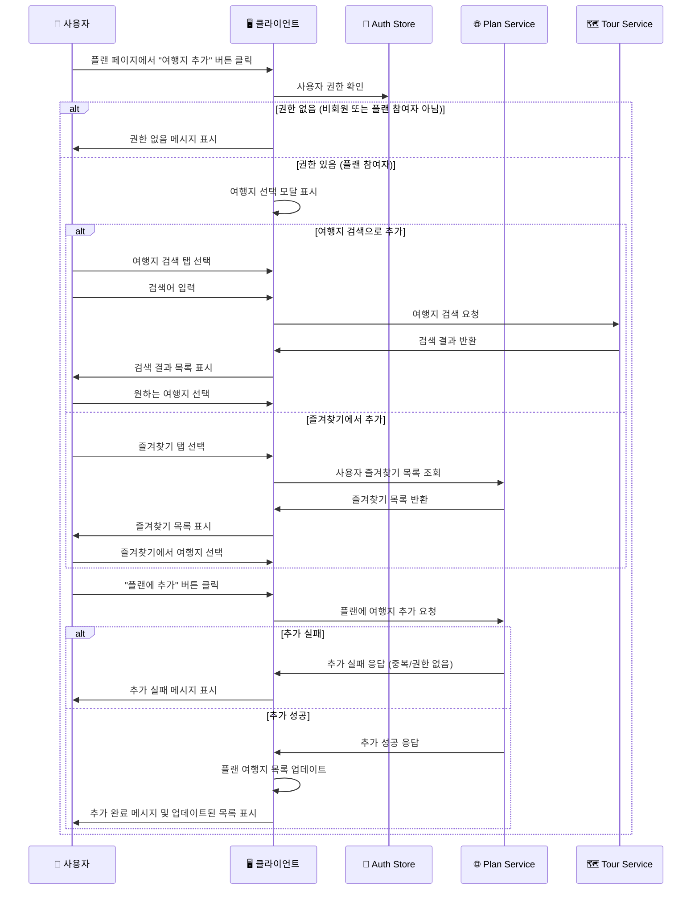
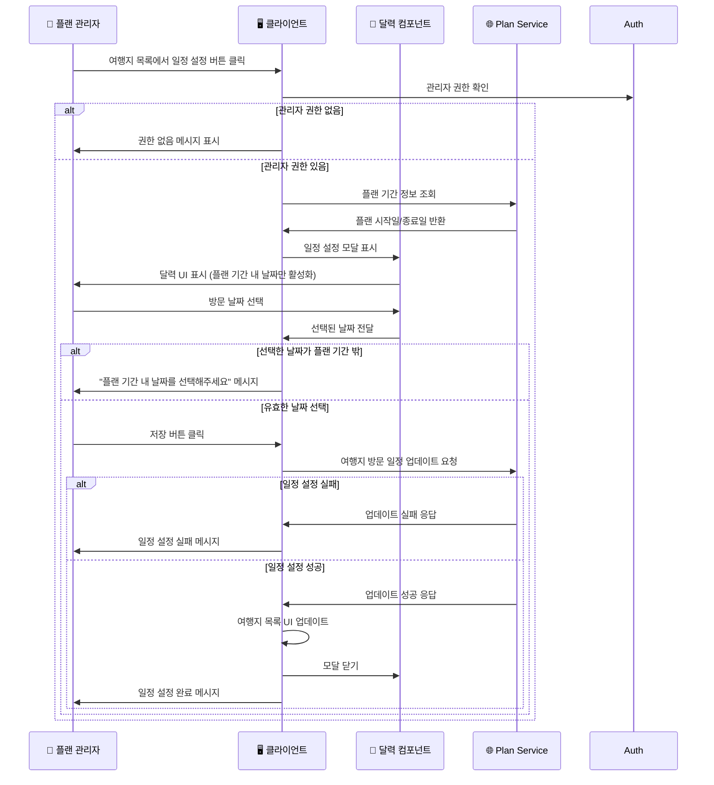
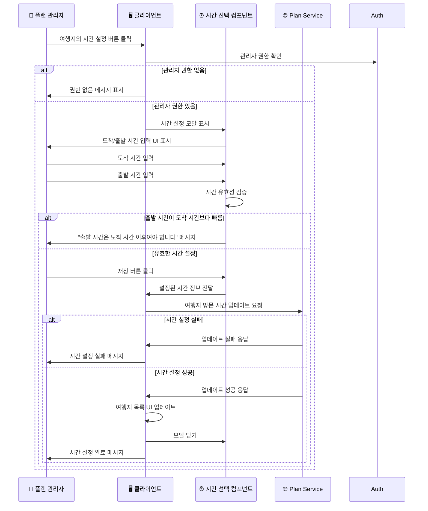
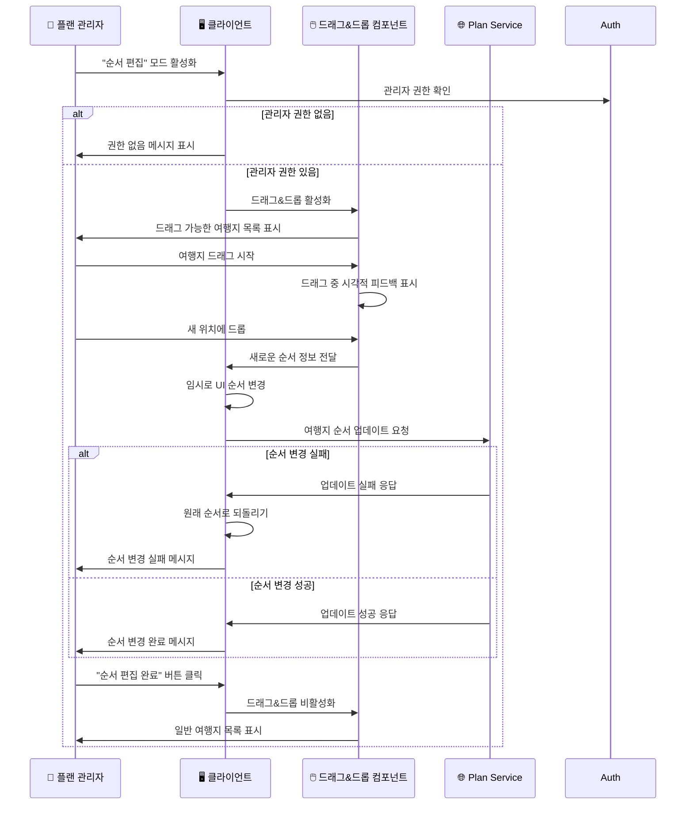
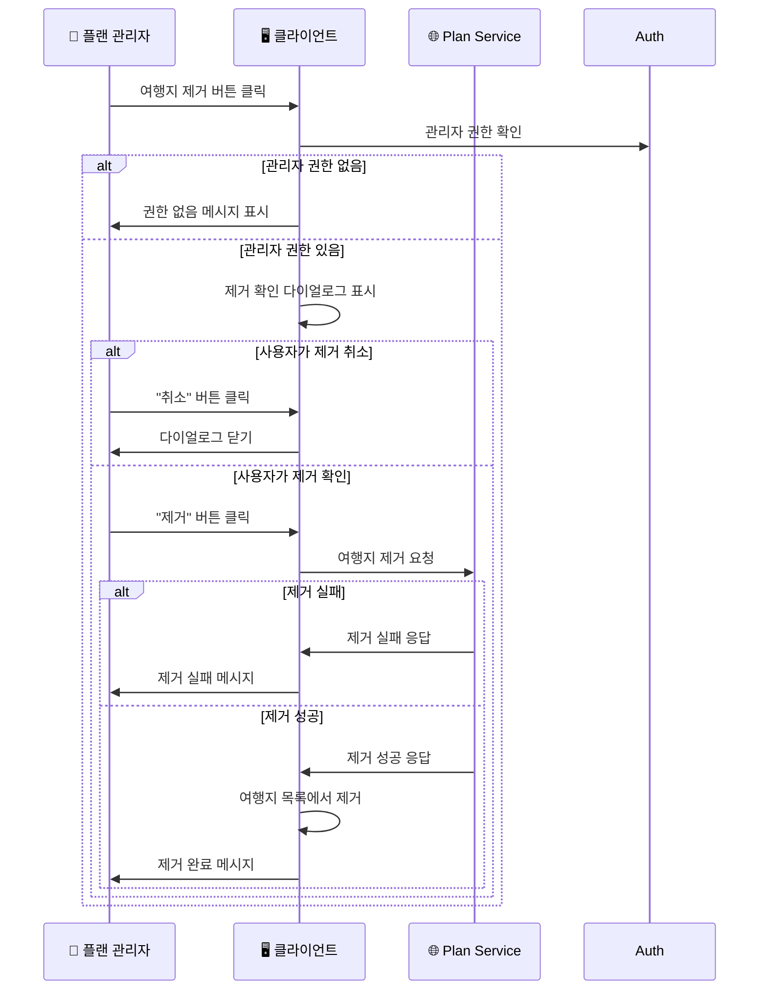
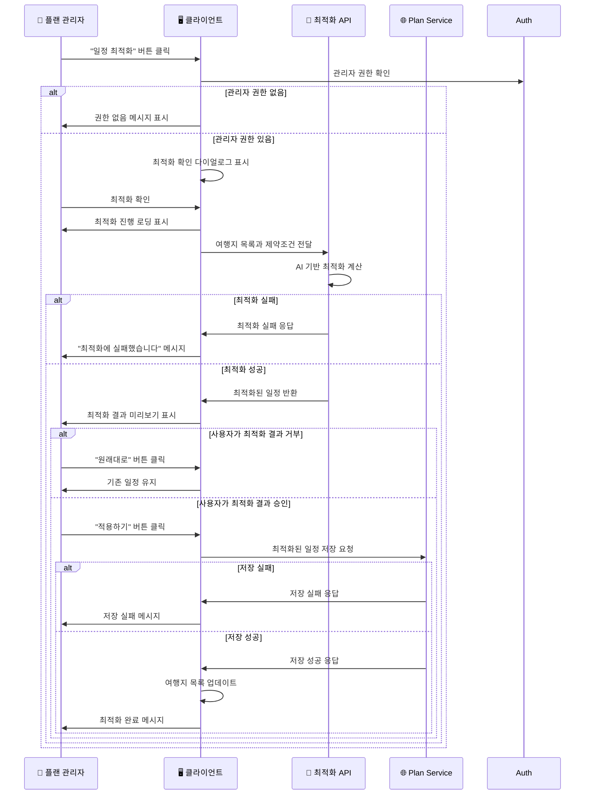

# 여행 일정 관리 시퀀스 다이어그램

## 1. 플랜에 여행지 추가 시퀀스

## 2. 여행지 방문 일정 설정 시퀀스

## 3. 여행지 방문 시간 설정 시퀀스

## 4. 여행지 순서 변경 시퀀스

## 5. 여행지 제거 시퀀스

## 6. 일정 자동 최적화 시퀀스

## 주요 특징

### 🎯 직관적인 일정 관리

- **드래그&드롭**: 시각적인 순서 변경으로 직관적인 조작
- **달력 연동**: 플랜 기간 내에서만 날짜 선택 가능
- **시간 검증**: 도착/출발 시간의 논리적 순서 검증

### 🤖 AI 기반 최적화

- **경로 최적화**: 여행지 간 거리와 이동시간을 고려한 순서 제안
- **시간 효율성**: 각 여행지의 운영시간과 혼잡도 고려
- **사용자 선택권**: 최적화 결과를 선택적으로 적용 가능

### 🔐 권한 기반 제어

- **관리자 전용**: 일정 수정은 플랜 관리자만 가능
- **참여자 제안**: 일반 참여자는 여행지 추가 제안만 가능
- **실시간 권한 검증**: 모든 액션 전 권한 확인

### 📱 반응형 UI

- **실시간 업데이트**: 일정 변경 시 즉시 UI 반영
- **시각적 피드백**: 드래그&드롭, 로딩 상태 등 명확한 피드백
- **모바일 최적화**: 터치 친화적인 일정 조작 인터페이스

### 🔄 데이터 동기화

- **실시간 동기화**: 여러 참여자 간 일정 변경사항 실시간 공유
- **충돌 방지**: 동시 편집 시 데이터 충돌 방지 메커니즘
- **백업 및 복구**: 일정 변경 실패 시 이전 상태로 롤백

### 🎨 사용자 경험

- **단계별 가이드**: 복잡한 일정 설정을 단계별로 안내
- **미리보기**: 변경사항 적용 전 미리보기 제공
- **실행 취소**: 중요한 변경사항에 대한 확인 절차
