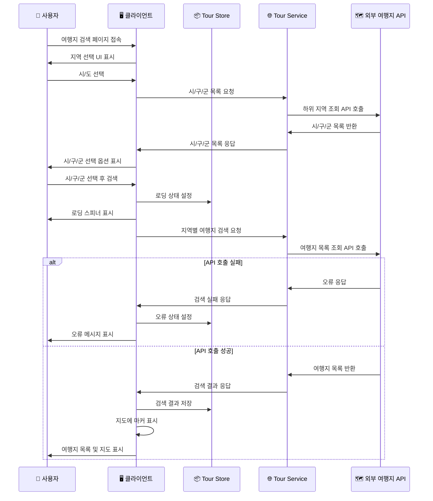
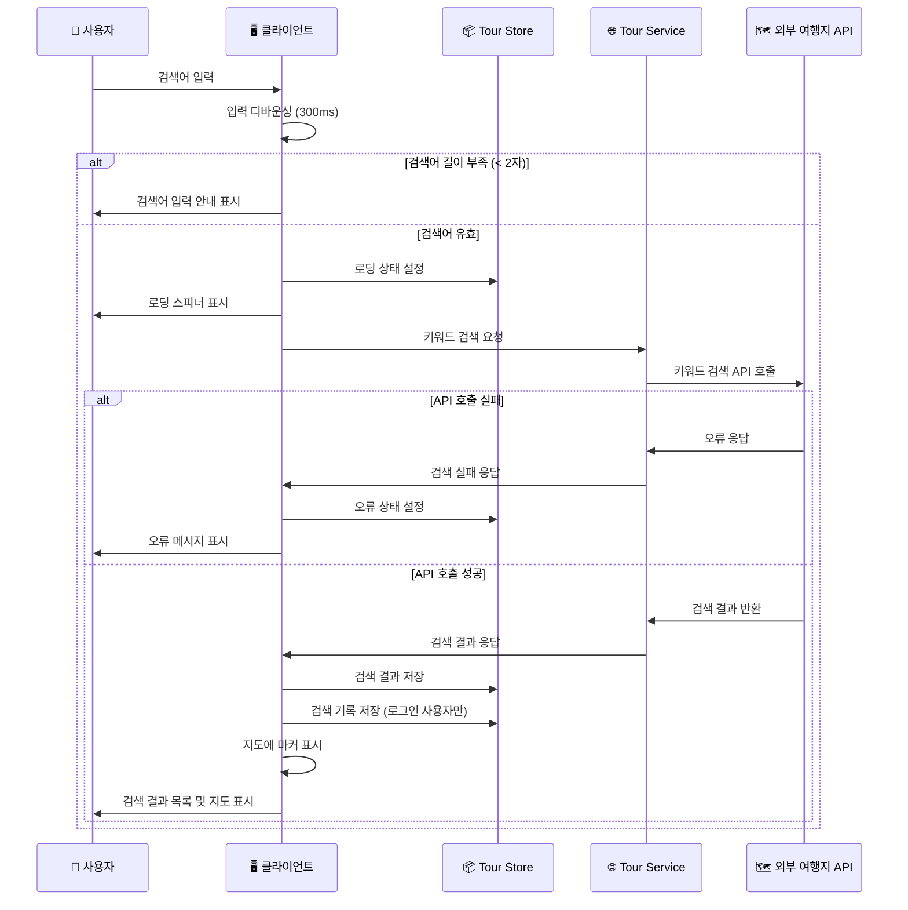
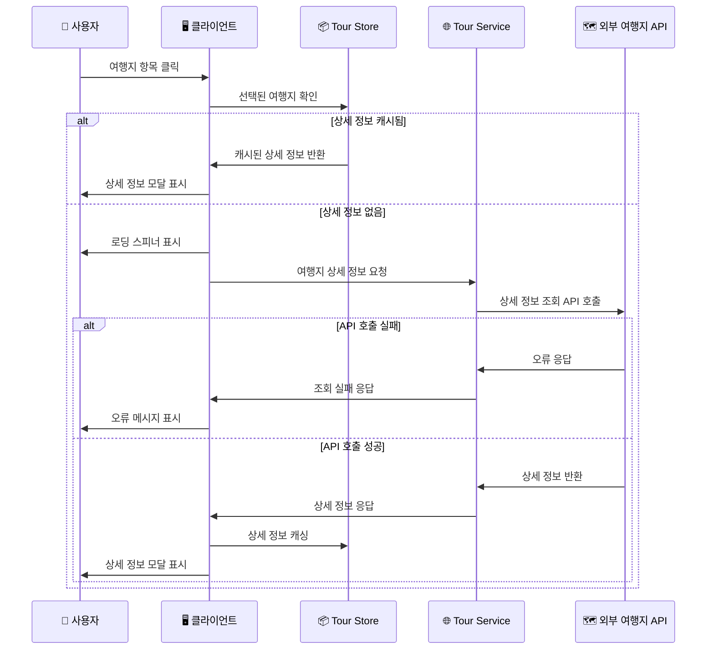
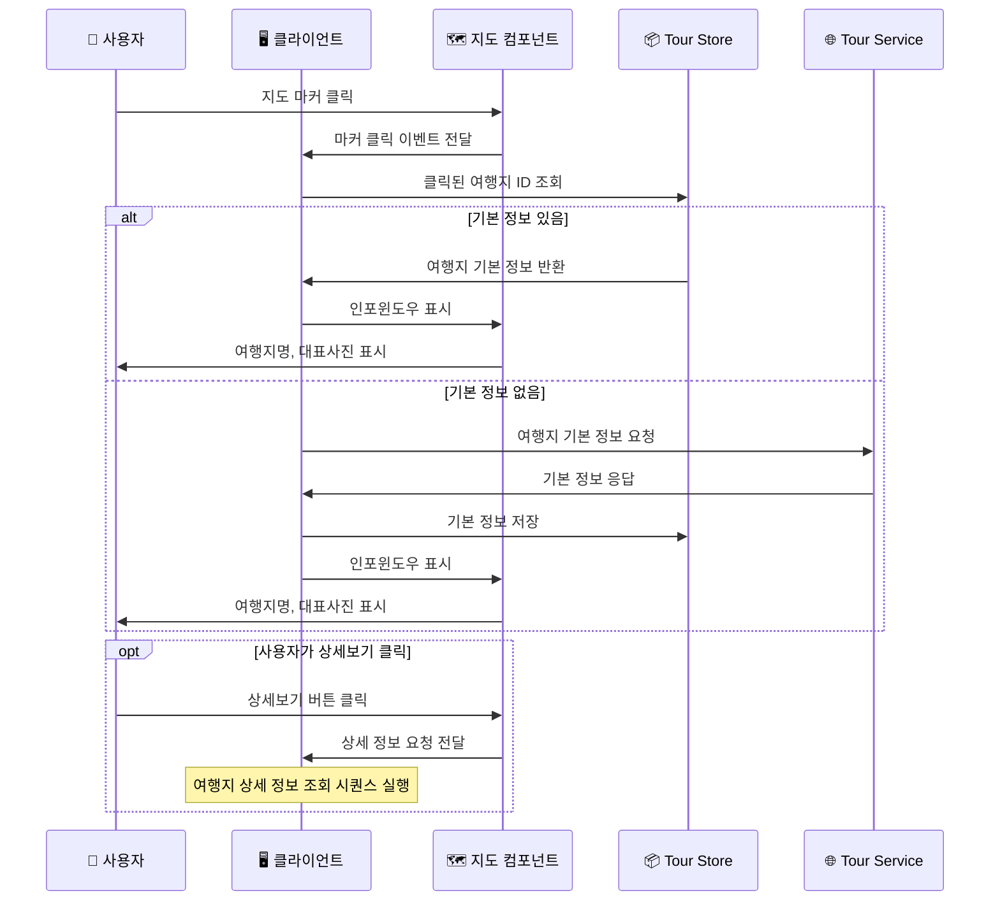
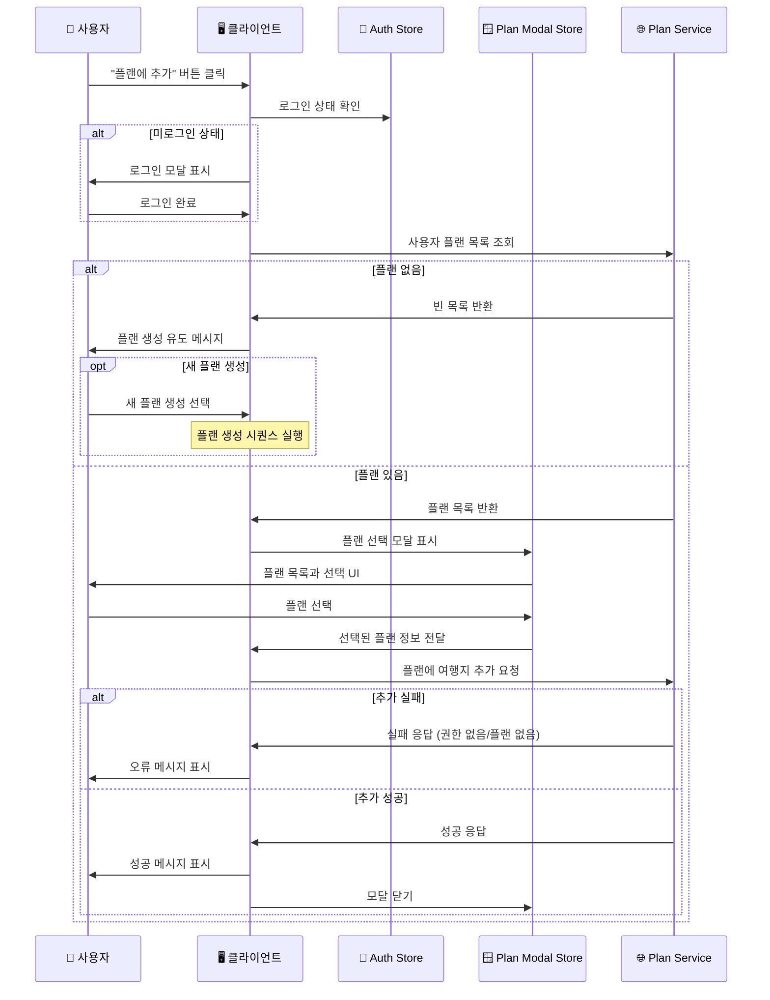
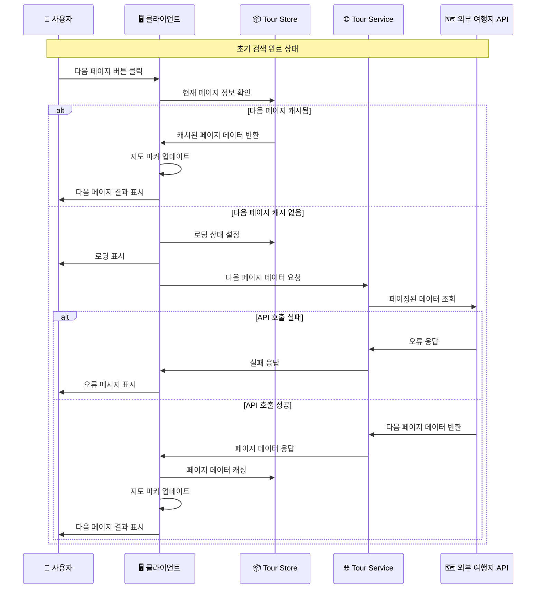

# 여행지 검색 시퀀스 다이어그램

## 1. 지역별 여행지 검색 시퀀스

## 2. 키워드 여행지 검색 시퀀스

## 3. 여행지 상세 정보 조회 시퀀스

## 4. 지도 마커 클릭 시퀀스

## 5. 여행지를 플랜에 추가 시퀀스

## 6. 검색 결과 페이징 시퀀스

## 주요 특징

### 🚀 성능 최적화

- **디바운싱**: 검색 입력 시 과도한 API 호출 방지
- **캐싱**: 검색 결과와 상세 정보 캐싱으로 재요청 최소화
- **페이징**: 대량 데이터 처리를 위한 페이지네이션

### 🗺️ 지도 연동

- **실시간 마커**: 검색 결과에 따른 실시간 지도 마커 업데이트
- **인포윈도우**: 마커 클릭 시 간단한 정보 표시
- **지도 중심**: 검색 결과에 따른 지도 중심점 자동 조정

### 🔍 검색 기능

- **다중 검색**: 지역별 검색과 키워드 검색 동시 지원
- **검색 기록**: 로그인 사용자의 검색 기록 저장
- **자동완성**: 검색어 입력 시 자동완성 제안

### 🎯 사용자 경험

- **즉시 피드백**: 모든 액션에 대한 즉각적인 UI 피드백
- **오류 처리**: 네트워크 오류, API 오류에 대한 명확한 메시지
- **로딩 상태**: 데이터 로딩 중 적절한 스피너 표시

### 🔗 플랜 연동

- **원클릭 추가**: 검색 결과에서 바로 플랜에 추가 가능
- **권한 확인**: 플랜 추가 시 사용자 권한 자동 확인
- **플랜 선택**: 여러 플랜 중 선택하여 추가 가능
