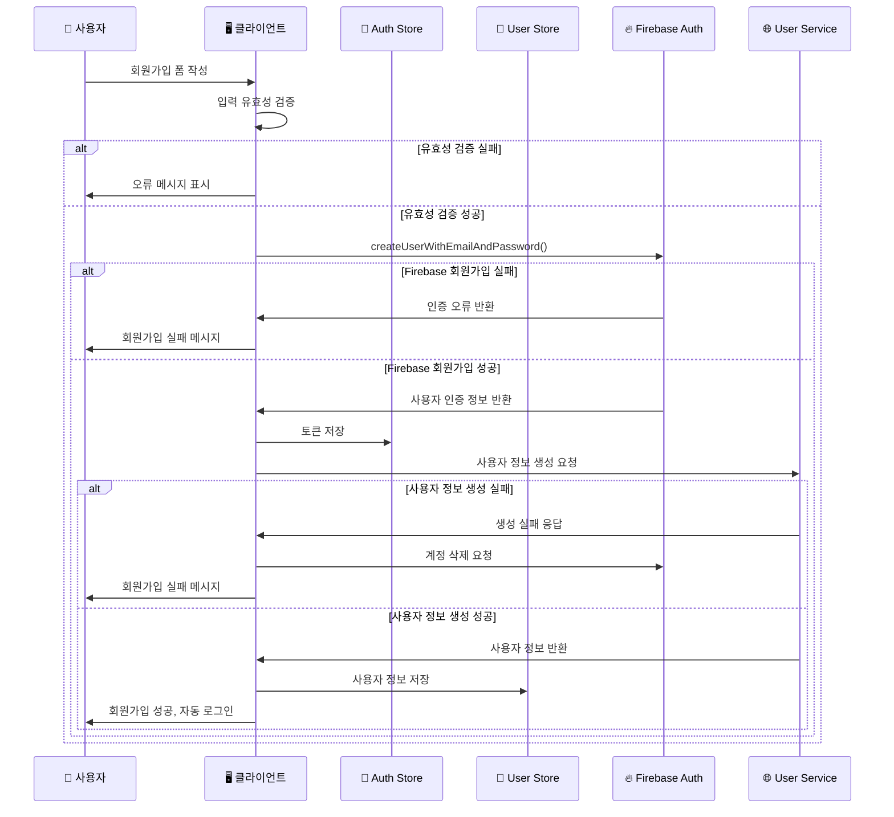
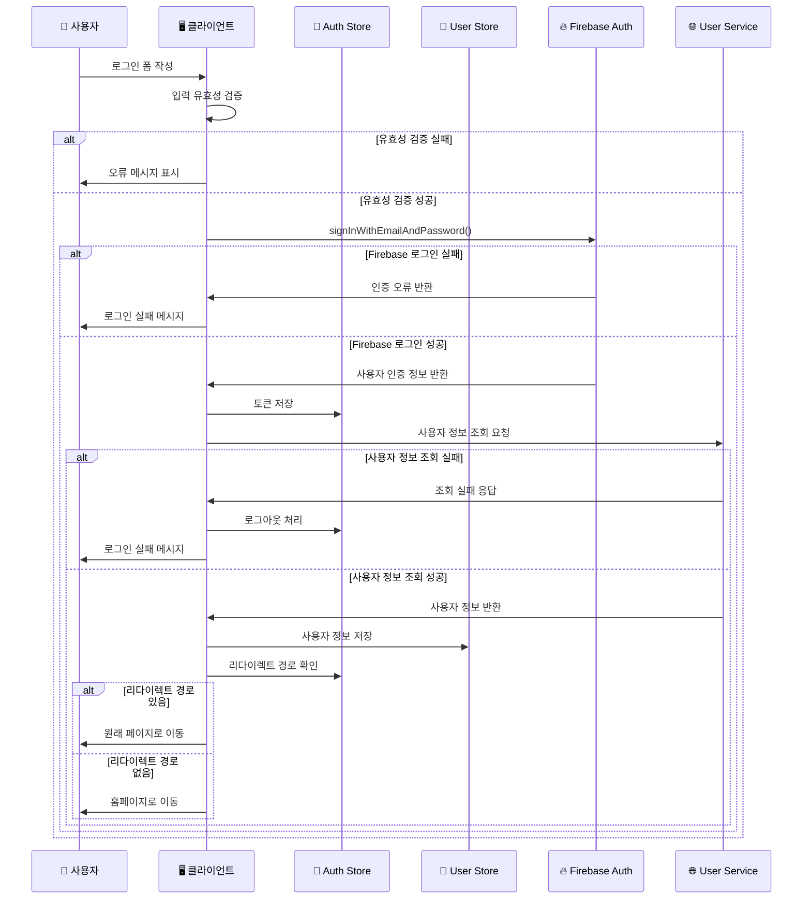
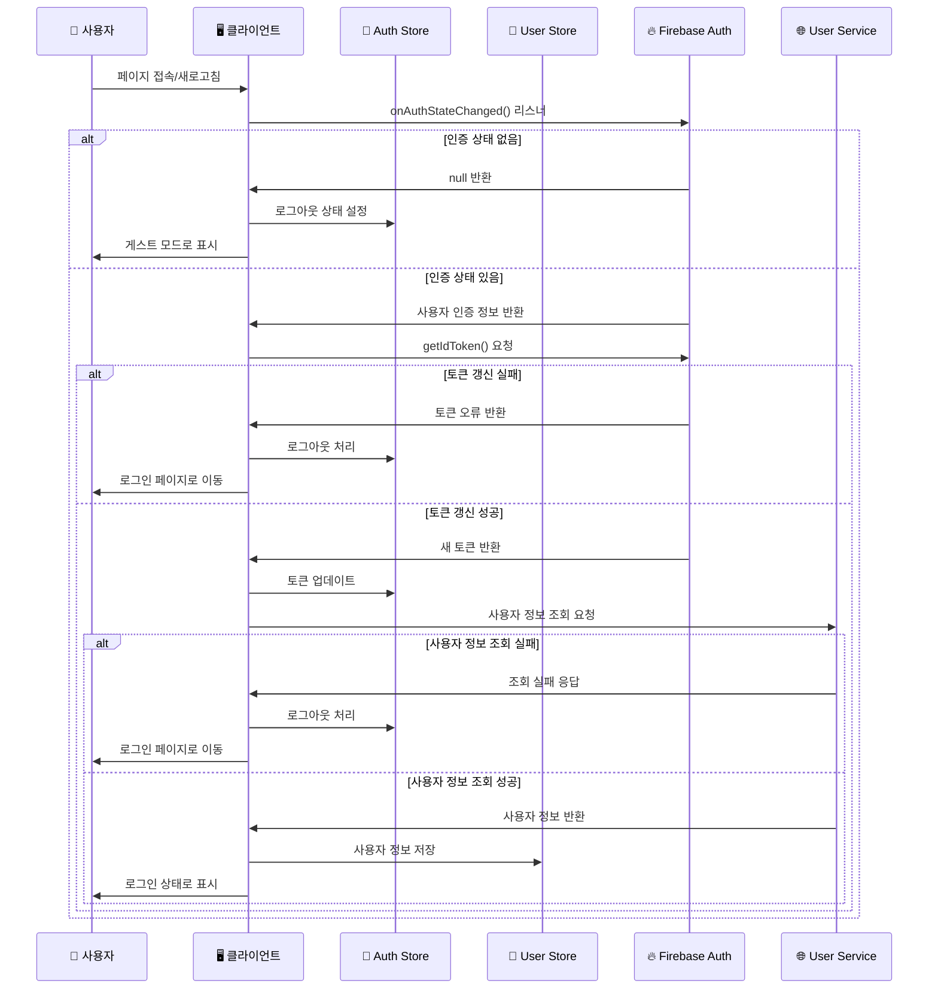
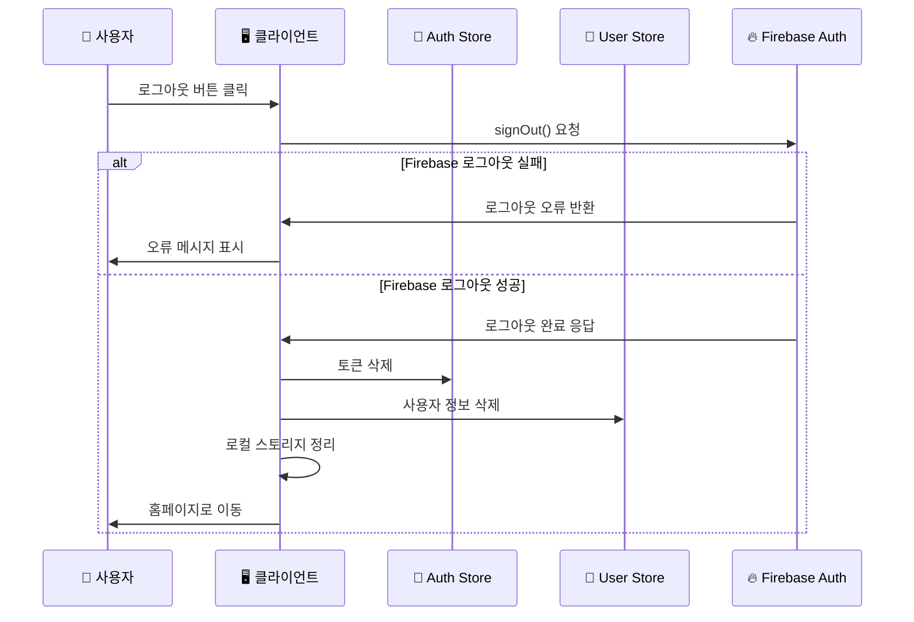
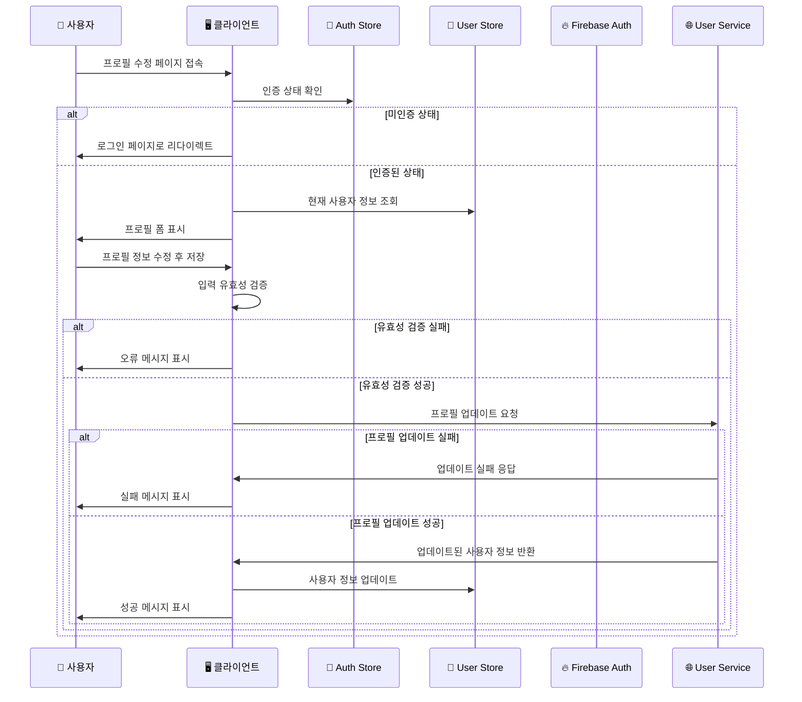

# 사용자 인증 시퀀스 다이어그램

## 1. 회원가입 시퀀스

## 2. 로그인 시퀀스

## 3. 자동 로그인 시퀀스

## 4. 로그아웃 시퀀스

## 5. 프로필 수정 시퀀스

## 주요 특징

### 🔐 보안 고려사항

- **토큰 검증**: 모든 API 요청 시 유효한 토큰 확인
- **자동 로그아웃**: 토큰 만료 시 자동으로 로그아웃 처리
- **입력 검증**: 클라이언트와 서버 양쪽에서 데이터 검증

### 🔄 상태 관리

- **Pinia Store**: 인증 상태와 사용자 정보를 중앙 집중 관리
- **실시간 동기화**: Firebase 인증 상태 변화를 실시간으로 감지
- **지속성**: 페이지 새로고침 시에도 로그인 상태 유지

### 🎯 사용자 경험

- **자동 리다이렉트**: 로그인 후 원래 페이지로 자동 이동
- **오류 처리**: 명확한 오류 메시지로 사용자 가이드
- **로딩 상태**: 인증 처리 중 적절한 로딩 표시

### 📱 반응성

- **즉시 반영**: 인증 상태 변화 시 UI 즉시 업데이트
- **캐싱**: 사용자 정보 캐싱으로 성능 최적화
- **오프라인 지원**: 네트워크 오류 시 적절한 처리
