# 여행 플랜 관리 유즈케이스 다이어그램

```mermaid
graph TD
    %% 액터 정의
    Owner[👤 플랜 관리자]
    Member[👤 플랜 참여자]
    Invitee[👤 초대받은 사용자]
    System[🏠 Trabuddy 시스템]

    %% 플랜 생성 및 기본 관리
    Owner --> UC1[새 플랜 생성]
    Owner --> UC2[플랜 기본 정보 수정]
    Owner --> UC3[플랜 삭제]
    Owner --> UC4[플랜 목록 조회]

    %% 플랜 정보 관리
    Owner --> UC5[플랜 제목 수정]
    Owner --> UC6[플랜 설명 수정]
    Owner --> UC7[플랜 메모 수정]
    Owner --> UC8[플랜 기간 설정]
    Owner --> UC9[플랜 인원 수 설정]
    Owner --> UC10[플랜 테마 설정]

    %% 참여자 관리
    Owner --> UC11[참여자 초대]
    Owner --> UC12[참여자 권한 변경]
    Owner --> UC13[참여자 추방]
    Owner --> UC14[초대 링크 생성]

    %% 여행지 관리
    Owner --> UC15[여행지 추가]
    Owner --> UC16[여행지 제거]
    Owner --> UC17[여행지 방문 일정 설정]
    Owner --> UC18[여행지 방문 시간 설정]
    Owner --> UC19[여행지 순서 변경]

    %% 참여자 기능
    Member --> UC4
    Member --> UC20[플랜 정보 조회]
    Member --> UC15
    Member --> UC21[의견 제안]

    %% 초대 기능
    Invitee --> UC22[초대 링크 접속]
    UC22 --> UC23[플랜 참여]

    %% 시스템 상호작용
    UC1 --> System
    UC2 --> System
    UC3 --> System
    UC4 --> System
    UC14 --> System
    UC22 --> System
    UC23 --> System

    %% 포함 관계 (include)
    UC1 -.->|include| UC24[플랜 ID 생성]
    UC2 -.->|include| UC25[권한 확인]
    UC11 -.->|include| UC26[이메일 유효성 검증]
    UC13 -.->|include| UC25
    UC15 -.->|include| UC27[여행지 유효성 검증]

    %% 확장 관계 (extend)
    UC28[플랜 템플릿 적용] -.->|extend| UC1
    UC29[일정 자동 최적화] -.->|extend| UC17
    UC30[플랜 공유] -.->|extend| UC20

    %% 조건부 관계
    UC12 -.->|only if owner| OwnerCheck[관리자 권한 확인]
    UC13 -.->|only if owner| OwnerCheck

    %% 스타일링
    classDef actor fill:#e1f5fe,stroke:#0277bd,stroke-width:2px
    classDef usecase fill:#f3e5f5,stroke:#7b1fa2,stroke-width:2px
    classDef system fill:#e8f5e8,stroke:#388e3c,stroke-width:2px
    classDef permission fill:#fff3e0,stroke:#f57c00,stroke-width:2px

    class Owner,Member,Invitee actor
    class System system
    class UC1,UC2,UC3,UC4,UC5,UC6,UC7,UC8,UC9,UC10,UC11,UC12,UC13,UC14,UC15,UC16,UC17,UC18,UC19,UC20,UC21,UC22,UC23,UC24,UC25,UC26,UC27,UC28,UC29,UC30 usecase
    class OwnerCheck permission
```

## 주요 유즈케이스 설명

### 플랜 생성 및 기본 관리

### UC1: 새 플랜 생성

- **액터**: 플랜 관리자
- **설명**: 새로운 여행 플랜을 생성
- **전제조건**: 사용자가 로그인됨
- **후속조건**: 새 플랜이 생성되고 사용자가 관리자로 설정됨

### UC2: 플랜 기본 정보 수정

- **액터**: 플랜 관리자
- **설명**: 플랜의 기본 정보들을 수정
- **전제조건**: 사용자가 플랜의 관리자
- **후속조건**: 플랜 정보가 업데이트됨

### UC3: 플랜 삭제

- **액터**: 플랜 관리자
- **설명**: 플랜을 영구적으로 삭제
- **전제조건**: 사용자가 플랜의 관리자
- **후속조건**: 플랜과 관련된 모든 데이터가 삭제됨

### UC4: 플랜 목록 조회

- **액터**: 플랜 관리자, 플랜 참여자
- **설명**: 사용자가 참여 중인 플랜 목록을 조회
- **전제조건**: 사용자가 로그인됨
- **후속조건**: 참여 중인 플랜들이 목록으로 표시됨

### 플랜 정보 관리

### UC5: 플랜 제목 수정

- **액터**: 플랜 관리자
- **설명**: 플랜의 제목을 수정
- **전제조건**: 사용자가 플랜의 관리자
- **후속조건**: 플랜 제목이 업데이트됨

### UC8: 플랜 기간 설정

- **액터**: 플랜 관리자
- **설명**: 여행의 시작 날짜와 끝 날짜를 설정
- **전제조건**: 사용자가 플랜의 관리자
- **후속조건**: 플랜 기간이 설정됨

### UC10: 플랜 테마 설정

- **액터**: 플랜 관리자
- **설명**: 플랜의 테마(힐링, 먹방, 혼자 여행)를 설정
- **전제조건**: 사용자가 플랜의 관리자
- **후속조건**: 플랜 테마가 설정됨

### 참여자 관리

### UC11: 참여자 초대

- **액터**: 플랜 관리자
- **설명**: 다른 사용자를 플랜에 초대
- **전제조건**: 사용자가 플랜의 관리자
- **후속조건**: 초대 알림이 발송됨

### UC12: 참여자 권한 변경

- **액터**: 플랜 관리자
- **설명**: 참여자의 권한을 관리자/참여자로 변경
- **전제조건**: 사용자가 플랜의 관리자
- **후속조건**: 참여자의 권한이 변경됨

### UC13: 참여자 추방

- **액터**: 플랜 관리자
- **설명**: 플랜에서 참여자를 제거
- **전제조건**: 사용자가 플랜의 관리자
- **후속조건**: 참여자가 플랜에서 제거됨

### UC14: 초대 링크 생성

- **액터**: 플랜 관리자
- **설명**: 플랜 참여를 위한 초대 링크를 생성
- **전제조건**: 사용자가 플랜의 관리자
- **후속조건**: 공유 가능한 초대 링크가 생성됨

### 여행지 관리

### UC15: 여행지 추가

- **액터**: 플랜 관리자, 플랜 참여자
- **설명**: 플랜에 방문할 여행지를 추가
- **전제조건**: 사용자가 플랜의 참여자
- **후속조건**: 여행지가 플랜에 추가됨

### UC16: 여행지 제거

- **액터**: 플랜 관리자
- **설명**: 플랜에서 여행지를 제거
- **전제조건**: 사용자가 플랜의 관리자
- **후속조건**: 여행지가 플랜에서 제거됨

### UC17: 여행지 방문 일정 설정

- **액터**: 플랜 관리자
- **설명**: 각 여행지의 방문 날짜를 설정
- **전제조건**: 사용자가 플랜의 관리자, 플랜 기간이 설정됨
- **후속조건**: 여행지에 방문 날짜가 할당됨

### UC18: 여행지 방문 시간 설정

- **액터**: 플랜 관리자
- **설명**: 각 여행지의 도착 시간과 출발 시간을 설정
- **전제조건**: 사용자가 플랜의 관리자
- **후속조건**: 여행지에 방문 시간이 설정됨

### 초대 및 참여

### UC22: 초대 링크 접속

- **액터**: 초대받은 사용자
- **설명**: 공유받은 초대 링크를 통해 플랜에 접속
- **전제조건**: 유효한 초대 링크
- **후속조건**: 플랜 정보가 표시되고 참여 옵션이 제공됨

### UC23: 플랜 참여

- **액터**: 초대받은 사용자
- **설명**: 초대받은 플랜에 참여
- **전제조건**: 사용자가 로그인됨, 유효한 초대 링크
- **후속조건**: 사용자가 플랜의 참여자로 추가됨

### 포함되는 유즈케이스

### UC24: 플랜 ID 생성

- **설명**: 새 플랜을 위한 고유한 식별자 생성
- **포함하는 유즈케이스**: 새 플랜 생성

### UC25: 권한 확인

- **설명**: 사용자가 해당 작업을 수행할 권한이 있는지 확인
- **포함하는 유즈케이스**: 플랜 기본 정보 수정, 참여자 추방

### UC27: 여행지 유효성 검증

- **설명**: 추가하려는 여행지가 유효한지 검증
- **포함하는 유즈케이스**: 여행지 추가

### 확장 유즈케이스

### UC28: 플랜 템플릿 적용

- **설명**: 미리 정의된 템플릿을 사용하여 플랜 생성
- **확장하는 유즈케이스**: 새 플랜 생성

### UC29: 일정 자동 최적화

- **설명**: AI를 활용하여 여행지 방문 순서를 최적화
- **확장하는 유즈케이스**: 여행지 방문 일정 설정

### UC30: 플랜 공유

- **설명**: 플랜 정보를 SNS나 다른 플랫폼으로 공유
- **확장하는 유즈케이스**: 플랜 정보 조회
