# Trabuddy 시스템 전체 유즈케이스 다이어그램

```mermaid
graph TD
    %% 액터 정의
    Guest[👤 게스트 사용자]
    User[👤 로그인 사용자]
    PlanOwner[👤 플랜 관리자]
    PlanMember[👤 플랜 참여자]

    %% 외부 시스템
    FirebaseAuth[🔥 Firebase 인증]
    TourAPI[🗺️ 여행지 API]
    MapAPI[🌍 지도 API]

    %% 주요 기능 그룹
    subgraph "인증 및 사용자 관리"
        UC_Auth1[회원가입]
        UC_Auth2[로그인]
        UC_Auth3[로그아웃]
        UC_Auth4[프로필 관리]
    end

    subgraph "여행지 검색 및 조회"
        UC_Search1[지역별 여행지 검색]
        UC_Search2[키워드 여행지 검색]
        UC_Search3[여행지 목록 조회]
        UC_Search4[지도에서 여행지 확인]
        UC_Search5[여행지 상세 정보 조회]
    end

    subgraph "플랜 생성 및 관리"
        UC_Plan1[새 플랜 생성]
        UC_Plan2[플랜 정보 수정]
        UC_Plan3[플랜 삭제]
        UC_Plan4[플랜 목록 조회]
    end

    subgraph "플랜 참여자 관리"
        UC_Member1[참여자 초대]
        UC_Member2[초대 링크 생성]
        UC_Member3[플랜 참여]
        UC_Member4[참여자 권한 관리]
        UC_Member5[참여자 추방]
    end

    subgraph "여행 일정 관리"
        UC_Schedule1[여행지 추가]
        UC_Schedule2[여행지 제거]
        UC_Schedule3[방문 일정 설정]
        UC_Schedule4[방문 시간 설정]
        UC_Schedule5[여행지 순서 변경]
    end

    %% 게스트 사용자 권한
    Guest --> UC_Search1
    Guest --> UC_Search2
    Guest --> UC_Search3
    Guest --> UC_Search4
    Guest --> UC_Search5
    Guest --> UC_Auth1
    Guest --> UC_Auth2

    %% 로그인 사용자 권한
    User --> UC_Auth3
    User --> UC_Auth4
    User --> UC_Plan1
    User --> UC_Plan4
    User --> UC_Member3

    %% 플랜 관리자 권한
    PlanOwner --> UC_Plan2
    PlanOwner --> UC_Plan3
    PlanOwner --> UC_Member1
    PlanOwner --> UC_Member2
    PlanOwner --> UC_Member4
    PlanOwner --> UC_Member5
    PlanOwner --> UC_Schedule2
    PlanOwner --> UC_Schedule3
    PlanOwner --> UC_Schedule4
    PlanOwner --> UC_Schedule5

    %% 플랜 참여자 권한
    PlanMember --> UC_Schedule1

    %% 외부 시스템 연동
    UC_Auth1 --> FirebaseAuth
    UC_Auth2 --> FirebaseAuth
    UC_Auth3 --> FirebaseAuth

    UC_Search1 --> TourAPI
    UC_Search2 --> TourAPI
    UC_Search3 --> TourAPI
    UC_Search5 --> TourAPI

    UC_Search4 --> MapAPI

    %% 주요 플로우 연결
    UC_Auth2 -.->|enables| UC_Plan1
    UC_Plan1 -.->|creates| UC_Member2
    UC_Member2 -.->|enables| UC_Member3
    UC_Search5 -.->|enables| UC_Schedule1

    %% 스타일링
    classDef actor fill:#e1f5fe,stroke:#0277bd,stroke-width:2px
    classDef usecase fill:#f3e5f5,stroke:#7b1fa2,stroke-width:2px
    classDef system fill:#e8f5e8,stroke:#388e3c,stroke-width:2px
    classDef group fill:#fafafa,stroke:#616161,stroke-width:1px

    class Guest,User,PlanOwner,PlanMember actor
    class FirebaseAuth,TourAPI,MapAPI system
    class UC_Auth1,UC_Auth2,UC_Auth3,UC_Auth4,UC_Search1,UC_Search2,UC_Search3,UC_Search4,UC_Search5,UC_Plan1,UC_Plan2,UC_Plan3,UC_Plan4,UC_Member1,UC_Member2,UC_Member3,UC_Member4,UC_Member5,UC_Schedule1,UC_Schedule2,UC_Schedule3,UC_Schedule4,UC_Schedule5 usecase
```



## 시스템 개요

Trabuddy는 **협업 여행 계획 서비스**로, 다음과 같은 핵심 기능들을 제공합니다:

### 1. 사용자 관리 시스템

- Firebase 기반 인증 시스템
- 회원가입, 로그인, 프로필 관리
- 자동 로그인 및 토큰 관리

### 2. 여행지 검색 시스템

- 지역별/키워드별 여행지 검색
- 외부 여행지 API 연동
- 지도 기반 여행지 위치 확인
- 여행지 상세 정보 제공

### 3. 협업 플랜 관리 시스템

- 개인/그룹 여행 플랜 생성
- 실시간 협업 기능
- 권한 기반 참여자 관리
- 초대 링크를 통한 간편 참여

### 4. 일정 관리 시스템

- 여행지 추가/제거/순서 변경
- 방문 날짜 및 시간 설정
- 플랜 내 여행지 관리

## 액터별 주요 기능

### 👤 게스트 사용자

- 모든 여행지 검색 및 조회 기능
- 회원가입 및 로그인

### 👤 로그인 사용자

- 개인 플랜 생성 및 관리
- 다른 플랜 참여
- 프로필 관리

### 👤 플랜 관리자

- 플랜의 모든 정보 관리
- 참여자 초대 및 권한 관리
- 여행 일정 전체 관리

### 👤 플랜 참여자

- 플랜 정보 조회
- 여행지 추가 제안
- 의견 및 코멘트 작성

## 주요 비즈니스 플로우

### 1. 새 사용자 온보딩

```
게스트 → 회원가입 → 로그인 → 프로필 설정 → 플랜 생성/참여
```

### 2. 플랜 생성 및 협업

```
플랜 생성 → 기본 정보 설정 → 초대 링크 생성 → 참여자 초대 → 협업 시작
```

### 3. 여행지 발견 및 추가

```
여행지 검색 → 상세 정보 확인 → 플랜에 추가 → 일정 조정
```

### 4. 플랜 완성

```
여행지 추가 → 방문 순서 설정 → 날짜/시간 조정 → 최종 확정
```

## 시스템 특징

### 🔐 보안

- Firebase 인증을 통한 안전한 사용자 관리
- 권한 기반 접근 제어
- 플랜별 참여자 권한 관리

### 🌐 확장성

- 외부 API 연동 구조
- 모듈별 독립적인 기능 구성
- 마이크로서비스 아키텍처 지향

### 👥 협업 중심

- 실시간 다중 사용자 협업
- 권한 기반 역할 분담
- 간편한 초대 시스템

### 📱 사용자 경험

- 게스트 모드 지원
- 직관적인 지도 기반 UI
- 반응형 웹 디자인
