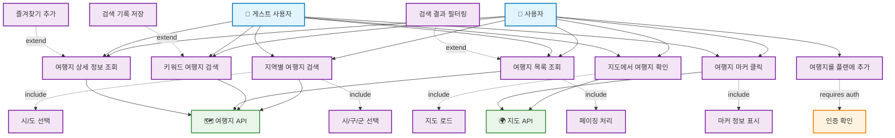

# 여행지 검색 유즈케이스 다이어그램

## 주요 유즈케이스 설명

### UC1: 지역별 여행지 검색

- **액터**: 사용자, 게스트 사용자
- **설명**: 시/도와 시/구/군을 선택하여 해당 지역의 여행지를 검색
- **전제조건**: 없음
- **후속조건**: 선택된 지역의 여행지 목록이 표시됨

### UC2: 키워드 여행지 검색

- **액터**: 사용자, 게스트 사용자
- **설명**: 키워드를 입력하여 관련 여행지를 검색
- **전제조건**: 검색할 키워드 입력
- **후속조건**: 키워드와 관련된 여행지 목록이 표시됨

### UC3: 여행지 목록 조회

- **액터**: 사용자, 게스트 사용자
- **설명**: 검색된 여행지들을 목록 형태로 조회
- **전제조건**: 검색 결과가 존재
- **후속조건**: 여행지 목록이 페이지별로 표시됨

### UC4: 여행지 상세 정보 조회

- **액터**: 사용자, 게스트 사용자
- **설명**: 특정 여행지의 상세 정보를 조회
- **전제조건**: 조회할 여행지 선택
- **후속조건**: 여행지의 상세 정보가 표시됨

### UC5: 지도에서 여행지 확인

- **액터**: 사용자, 게스트 사용자
- **설명**: 지도 상에서 검색된 여행지들의 위치를 확인
- **전제조건**: 검색 결과가 존재
- **후속조건**: 지도에 여행지 마커들이 표시됨

### UC6: 여행지 마커 클릭

- **액터**: 사용자, 게스트 사용자
- **설명**: 지도의 여행지 마커를 클릭하여 간단한 정보 확인
- **전제조건**: 지도에 마커가 표시됨
- **후속조건**: 여행지명과 대표 사진이 팝업으로 표시됨

### UC7: 여행지를 플랜에 추가

- **액터**: 로그인된 사용자
- **설명**: 선택한 여행지를 자신의 여행 플랜에 추가
- **전제조건**: 사용자가 로그인됨, 추가할 플랜이 존재
- **후속조건**: 여행지가 플랜에 추가됨

### UC8: 시/도 선택

- **설명**: 지역별 검색 시 시/도를 선택하는 단계
- **포함되는 유즈케이스**: 지역별 여행지 검색

### UC9: 시/구/군 선택

- **설명**: 시/도 선택 후 시/구/군을 선택하는 단계
- **포함되는 유즈케이스**: 지역별 여행지 검색

### UC10: 페이징 처리

- **설명**: 많은 검색 결과를 페이지별로 나누어 표시
- **포함되는 유즈케이스**: 여행지 목록 조회

### UC11: 지도 로드

- **설명**: 지도 API를 사용하여 지도를 로드
- **포함되는 유즈케이스**: 지도에서 여행지 확인

### UC12: 마커 정보 표시

- **설명**: 클릭된 마커의 여행지 정보를 팝업으로 표시
- **포함되는 유즈케이스**: 여행지 마커 클릭

### 확장 유즈케이스

### UC13: 검색 결과 필터링

- **설명**: 검색 결과에 추가적인 필터를 적용
- **확장하는 유즈케이스**: 여행지 목록 조회

### UC14: 검색 기록 저장

- **설명**: 사용자의 검색 기록을 저장하여 재검색 편의성 제공
- **확장하는 유즈케이스**: 키워드 여행지 검색

### UC15: 즐겨찾기 추가

- **설명**: 관심 있는 여행지를 즐겨찾기에 추가
- **확장하는 유즈케이스**: 여행지 상세 정보 조회
