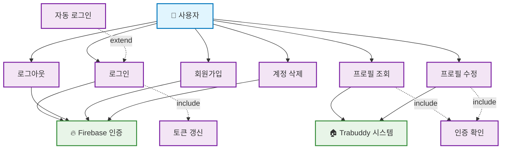

# 사용자 인증 및 관리 유즈케이스 다이어그램

## 주요 유즈케이스 설명

### UC1: 로그인

- **액터**: 사용자
- **설명**: 사용자가 Firebase 인증을 통해 시스템에 로그인
- **전제조건**: 사용자가 미로그인 상태
- **후속조건**: 사용자 정보가 저장되고 인증 토큰이 발급됨

### UC2: 로그아웃

- **액터**: 사용자
- **설명**: 사용자가 시스템에서 로그아웃
- **전제조건**: 사용자가 로그인된 상태
- **후속조건**: 로컬 저장된 사용자 정보 및 토큰이 삭제됨

### UC3: 회원가입

- **액터**: 사용자
- **설명**: 새로운 사용자가 Firebase를 통해 계정 생성
- **전제조건**: 유효한 이메일 주소
- **후속조건**: 새로운 사용자 계정이 생성되고 자동 로그인됨

### UC4: 프로필 조회

- **액터**: 사용자
- **설명**: 로그인된 사용자가 자신의 프로필 정보 조회
- **전제조건**: 사용자가 로그인된 상태
- **후속조건**: 사용자 프로필 정보가 표시됨

### UC5: 프로필 수정

- **액터**: 사용자
- **설명**: 로그인된 사용자가 자신의 프로필 정보 수정
- **전제조건**: 사용자가 로그인된 상태
- **후속조건**: 수정된 정보가 시스템에 저장됨

### UC6: 계정 삭제

- **액터**: 사용자
- **설명**: 사용자가 자신의 계정을 영구적으로 삭제
- **전제조건**: 사용자가 로그인된 상태
- **후속조건**: 사용자 계정과 관련 데이터가 모두 삭제됨

### UC7: 토큰 갱신

- **설명**: 만료된 인증 토큰을 자동으로 갱신
- **트리거**: 토큰 만료 감지

### UC8: 인증 확인

- **설명**: 보호된 기능 접근 시 사용자 인증 상태 확인
- **트리거**: 인증이 필요한 페이지/기능 접근

### UC9: 자동 로그인

- **설명**: 이전에 로그인한 사용자의 자동 로그인 처리
- **트리거**: 페이지 새로고침 또는 재방문 시
